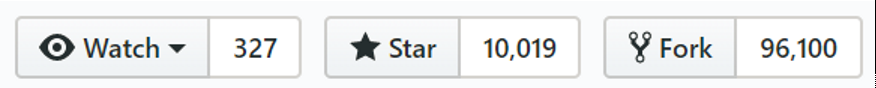
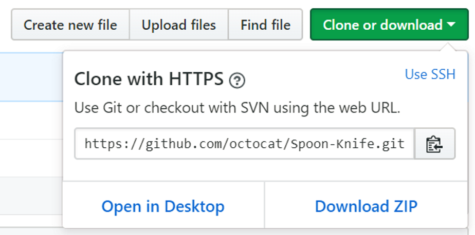
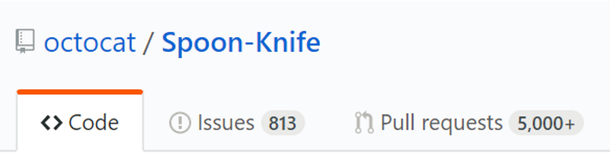
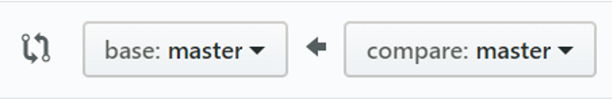

# How To Contribute Changes

## Overview 

This is a beginner's guide to make contributions to an ADFS Open Source project. This guide will teach you the basics you need to start contributing to an ADFS Open Source project. 

## Create a GitHub Account 

All ADFS Open Source projects are hosted on GitHub. To view and download code, you do not need an account. However, if you wish to contribute changes or updates, you will need to sign up [here](https://github.com/join?source=header-home)

## Set Up Your Development Machine

1. [Install Git](https://www.atlassian.com/git/tutorials/install-git#windows) 
    Git is the go-to choice for version control. It's the tool you will use to commit new code. 
    For more, read ['What is Git?'](https://www.atlassian.com/git/tutorials/what-is-git)

2. Create a directory for your code
    It's a good idea to keep all your git projects together in one place.
    For this tutorial, we will create the folder `F:/git` to hold all our projects.

## Fork a Project

In GitHub, the way you contribute to a public project is through a *fork*. A *fork* is a personal copy of a public project. When you fork a project, GitHub keeps track of which project you forked from, which makes it easy to bring your changes back into the public project, when the time comes. 
    

To fork a project, locate the GitHub project you wish to fork, and then, in the top right, locate the "fork" button.
    

    
When you click "fork", you will be asked to sign in if you haven't already. When the fork is complete, you will have your own copy of the public project you chose to fork. 

## Clone Your Forked Project

Once you have a forked projec, you will need to clone that project to your local machine. 
    
> *What's the Difference Between a Fork and a Clone?* A fork is a split from a public project. A fork is a complete, stand-alone copy of another project.
> A clone is a local instance of a repository. All repositories live on the GitHub servers, which forms the "remote" version of the repository. When you clone a repository, you create a "local" version, which lives on your machine. Changes that are made to either the remote or local versions will be synced together when you run `git push` or `git pull`. 

To clone your project, go to the GitHub page of the project, and locate the clone button on the right side. 
    

    
Next, copy the link that is given. 
    
In PowerShell on your local machine, navigate to the folder where you will keep all your git projects (for us, it's `F:/git`).
    
    PS > cd F:/git

Now clone the project using "git clone", like this:

    PS > git clone <link>

For example
    
    PS > git clone https://github.com/octocat/Spoon-Knife.git
    
This will create a new folder under `F:/git`, called `F:/git/Spoon-Knife`. This new folder contains all the code in the project you cloned. 

## Making Code Changes
    
Now that you have a project cloned locally, you can start making changes. 
    
In git, all changes should be made on a new branch. A branch is just a way to organize your code. Let's create a new branch for a change we want to make. 

First, you must decide on a branch name. Generally the name should be short, and descriptive of what the change will be. For example, `fixLoggingBug` or `addTelemetryFeature`.
    
    PS > cd F:/git/Spoon-Knife
    PS > git branch -b myBranchName

You have now created a new branch. To switch between branches, run `git checkout <branchname>`.
    
Now you can make any changes you need directly to the files in `F:/git/Spoon-Knife`. Git will keep track of all changes you make, whether it's changes to an existing file, file creations, or deletes. 

## Committing Your Changes
    
Git keeps track of your changes as you make them. When you are satisfied, you can "commit" your changes. 
    
First, in PowerShell, navigate to the folder with your project.
    
    PS > cd F:/git/Spoon-Knife/
    
Now, let's check the status of our changes
    
    PS > git status
    
On the command line, you will see all the changes you have made. Your changes should show up in red letters under "changes not staged for commit". You can now choose which files you want to add to this new commit. You can add them individually by name, or use "." to add all of them.
    
    PS > git add <filename>

    Or

    PS > git add . 
    
Now let's check the status again
    
    PS > git status
    
Your changes should be in green letters under "changes to be committed". Now we're ready to commit. We will use the `git commit` command, and supply a short message describing what the changes are. 
    
    PS > git commit -m "Message for this commit" 
    
Now we have a new commit in our local repository. Let's sync this change up to our remote project on GitHub. 
    
    PS > git push 

    (Note: if this is the first time you are pushing, Git will give you a command to run to set-upstream. Copy that command and run it)
    
We're all done! Your new commit has now been pushed to the remote repository.

## Pull Your Changes to the Original Public Project

Now that you have changes made to your forked project, let's bring them back into the original ADFS Open Source project. 
    
First, go to the GitHub page for your forked project, and locate the "Pull Requests" tab. 
    

        
From there, create a new pull request
    

For the "compare" branch, choose the branch you created for your changes: `myBranchName`
    
For the "base" branch, locate the Dev branch of the original public project. For most ADFS Open Source projects, there will be a Dev branch. However, if there is not, choose the "master" branch. Be sure that you choose the branch from the original public project, and not your forked project. 

    
Now, on the right side, under "Reviewers", locate a member of the ADFS Open Source team. The most common choice is `bongiovimatthew-microsoft`. 
    
Select "Create Pull Request", and you're done. Your changes will be reviewed by the ADFS Open Source community, and when the changes have been approved, they will be merged into the original public project. 