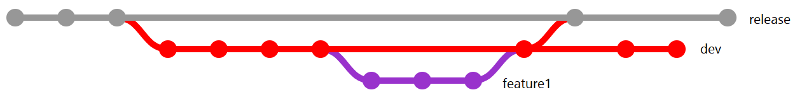

# ADFS Open Source Guidance

## What Belongs on ADFS Open Source?

ADFS Open Source projects should provide some benefit to ADFS customers, but not require internal ADFS changes. The general guidance for ADFS Open Source projects is that if a customer might want to use it, and it can be shipped out-of-band with ADFS, we should put it on GitHub. 

Examples of projects that belong on ADFS Open Source include

* All public scripts or tools related to ADFS diagnosability, debugging, management, etc. that are not strictly part of the ADFS codebase

* All pluggable components that are not strictly part of the ADFS codebase (authentication adapters, relying parties, web customizations, etc.) 

## Who Supports ADFS Open Source?

The ADFS Product Group is invested in each project available through ADFS Open Source. However, there is no SLA for change requests, and no servicing process for hot fixes. A benefit of open source projects it that they are community-owned, so any bugs that are discovered, or feature requests that are proposed can be implemented by anyone in the community. 

## Release Requirements

### * Code:
Before releasing a new project, or a change to an existing project, the contribution must have some core functionality working.  

It is acceptable to have items marked as "TODO", "bug", etc. in the Dev branch of a project, but these issues must be resolved before merging to the release branch.
        
### * Documentation:
All new projects must have basic documentation covering the following:  
    
* Project Overview (what is this project?)
* Requirements to install (what do I need to have to run this project?)
* Steps to install (how do I install/deploy this project?
* Usage steps and examples (how do I use this project?)
* Contributing changes (how do I make changes to this project? How do I validate I didn't break anything?) 
* Any special notes that are important for this project, where applicable 
        
### * Tests:
    
All projects must have a base level of test coverage, or a proposed plan for implementing test coverage. 

Test coverage can include internal ADFS tests or internal production deployment. However, this is discouraged, as tests should allow community contributors to validate that their changes have not broken existing behavior.
    
### * Code review:
    
Every change must be reviewed in accordance with the review process (see below) 

## Branching

Each project should contain two long-lived branches:
* A Release branch (master), with tags at each major release, and 
* A Dev branch for pre-release changes and stabilization 

All changes should be made in Feature branches first. Feature branches should be off the Dev branch for any bug fix, feature addition, doc change, etc. 

Each project should maintain a long-lived Debug branch where appropriate (for example, maintaining JavaScript with verbose logging) 

## Code Review Process

Each change will be reviewed when the Feature branch for the change is being merged to the Dev branch. Pull request must have at least one reviewer sign-off before merging to Dev. In the case where the merge is occurring from a forked project into the primary project Dev branch, this review sign-off will have to be by an ADFS Open Source team administrator.

Each change will also be batch-reviewed for release when the Dev branch is periodically merged to master. This review process will require sign-off from an ADFS Open Source team administrator.

## Project Structure for Repositories 

Each repository will be a collection of similar projects. The main repository should contain a readme with links to, and descriptions of, each project in the repo. 

## Project Release Cadence 

Each project will maintain its own release cadence. Most projects will be released on an as-needed basis, and not on a calendar release basis. When the project owners feel that enough changes exist in the Dev branch to warrant a new release, a release will occur.  